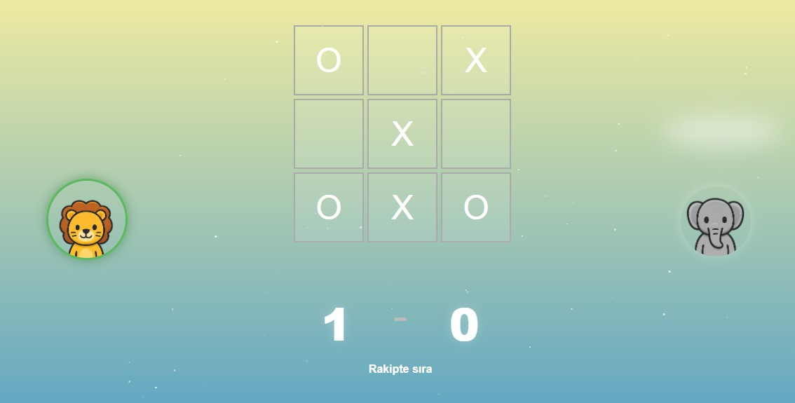

#  XOXO Game – Multiplayer & Computer Mode 



A modern, web-based Tic-Tac-Toe (XOXO) game. Players can choose avatars and play against each other in real-time. A "Play Against Computer" mode is designed and will be implemented soon.

## 🔗 [Play the Game Live](https://gaming-secure-1-0.onrender.com)

> 🧑‍🤝‍🧑 **Both players must select their avatars** before the game begins.  
> 🎯 **Real-time multiplayer:** Share the link, open it from different URLs and play together.


## 📂 Project Structure

<details>
  <summary>Click to expand</summary>

```plaintext
📁 xoxo-game
├── public/
│   └── index.html
├── js/
│   ├── common/
│   │   ├── board.js
│   │   ├── logic.js
│   │   ├── state.js
│   │   └── ui.js
│   ├── modes/
│   │   └── multiplayer.js
│   ├── background.js
│   └── main.js
├── script.js
├── style.css
├── server/
│   └── routes/
│       └── index.js
├── .env
├── .github/
│   └── workflows/
│       └── deploy.yml
```
</details>

---


## 🛠️ Tech Stack

- **Node.js** & **Express.js** – Backend and server setup
- **Socket.IO** – Real-time communication
- **Vanilla JavaScript** – Modular frontend
- **Render** – Hosting and deployment platform
- **GitHub Actions** – CI/CD pipeline for auto deployment

## 🚀 Deployment

The app is deployed to [Render](https://render.com) automatically on every commit using GitHub Actions.  
CI/CD is configured in `.github/workflows/deploy.yml`.


## 🚧 Planned Features

- [ ] 💬 Room-based in-game chat
- [ ] 🤖 Play against computer mode
- [ ] 🌐 Multilingual support
- [ ] 📱 Mobile responsive design


## 📌 Notes

- Only part of the source code is public.
- "Play Against Computer" mode is planned but not functional yet.
- Multiplayer mode is fully working and live.

## Related Medium Articles

- [How to Deploy without pushing all code ? ](https://medium.com/@deryayildirimm/koddan-canlıya-docker-render-ile-basit-deployment-bca1e26a3ad2)

- [Insert a Smoke Test with Github Action ](https://medium.com/@deryayildirimm/deploying-to-render-insert-a-smoke-test-step-with-github-actions-ffbd49a104dd)